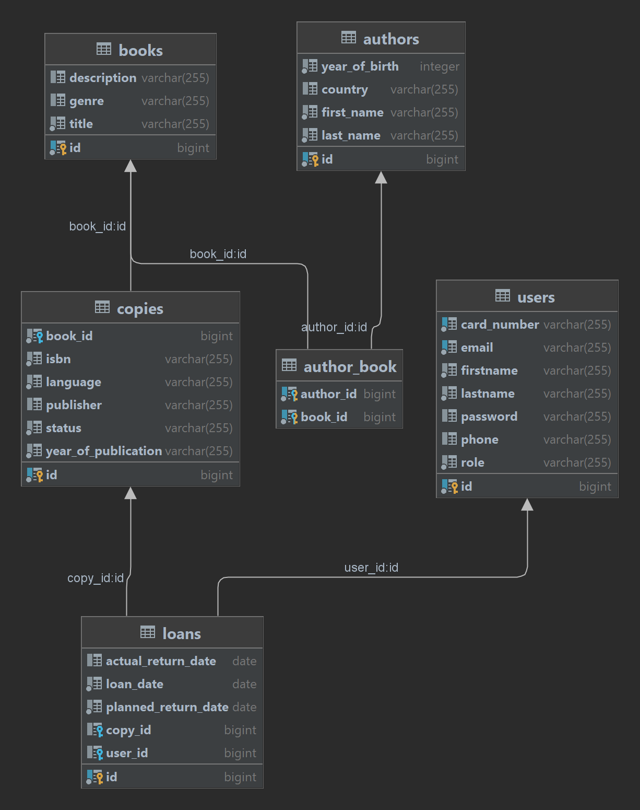

# MyLibrary

# Spis treści

- [**Opis aplikacji**](#opis-aplikacji)
- [**Uruchomienie aplikacji**](#uruchomienie-aplikacji)
- [**Działanie aplikacji**](#działanie-aplikacji)
- [**Dodatkowe informacje**](#dodatkowe-informacje)


# Opis aplikacji


Aplikacja **MyLibrary** pozwala na zarządanie zasobami biblioteki, takimi jak książki, autorzy, czy wypożyczenia.
Pomaga ona w codziennej pracy bibliotekarza, jak i ułatwia czytelnikom korzystanie z zasobów biblioteki.
Interacja z aplikacją odbywa się poprzez interfejs bibliotekarza dostępny po zalogowaniu.

# Uruchomienie aplikacji
1. **Sklonuj repozytorium**
    ```bash
    git clone https://github.com/Hunes73/MyLibrary-JavaFX.git
    ```
   
2. **Przejdź do katalogu z projektem**
    ```bash
    cd MyLibrary-JavaFX
    ```

3. **Przygotuj bazę danych Postgres**
   - Docker
     - Uruchom kontener z bazą danych w katalogu z projektem:
         ```bash
         docker-compose up
         ```
     - Konfiguracja dostępna jest w pliku 'docker-compose.yml'
   - Lokalnie
     - Utwórz bazę o nazwie `mylibraryfx`:
       ```pgsql
       CREATE DATABASE mylibraryfx;
       ``` 
      - W pliku `src/main/resources/application.properties` zmień dane dostępowe do bazy danych:
       ```properties
       spring.datasource.url=jdbc:postgresql://localhost:$PORT/mylibraryfx
       spring.datasource.username=$USERNAME
       spring.datasource.password=$PASSWORD
       ```

4. **Uruchom aplikację**
    ```bash
    mvn spring-boot:run
    ```
   
5. **Zmień sposób inicializacji bazy danych**
    - W pliku `src/main/resources/application.properties` zmień wartość `spring.jpa.hibernate.ddl-auto` na:
        - `create` - aby w każdym uruchomieniu aplikacji baza była czyszczona i ponownie inicjalizowana
        - `update` - aby baza nie była czyszczona, a jedynie aktualizowana przy uruchomieniu aplikacji

# Działanie aplikacji
Aby zalogować się do aplikacji należy użyć następujących danych:
- numer karty: admin
- hasło: admin
Konto to ma uprawnienia administratora, co oznacza, że ma dostęp do zarządania zasobami biblioteki.

Po zalogowaniu administratorowi zostanie wyświetlone okno główne aplikacji, w którym znajdują się zakładki:
- Autorzy
- Czytelnicy
- Egzemplarze
- Książki
- Wypożyczenia

Każda z zakładek pozwala na wyświetlenie, dodanie, edycję oraz usunięcie zasobów związanych z daną encją.
Wyświetlane dane można sortwoać poprzez kliknięcie w nagłówek kolumny.asdm  
Wprowadzane dane są walidowane, a użytkownik jest informowany o błędach poprzez komunikaty.
Aby zalogować się jako czytelnik, należy utworzyć nowe konto w aplikacji.

Czytelnik ma dostęp do zakładek:
- Przeglądaj książki
- Przeglądaj egzemplarze
- Przeglądaj autorów
- Przeglądaj moje wypożyczenia

# Dodatkowe informacje

**Diagram relacji między encjami**



**Użyte technologie:**
- Język programowania: Java
- Framework: Spring Boot
- Interfejs graficzny: JavaFX
- Automatyzacja budowania: Maven
- Baza danych: PostgreSQL
- Autoryzacja i autentykacja: Spring Security
- Komunikacja z bazą danych: Spring Data JPA
- Konteneryzacja: Docker
- Kontrola wersji: Git
- Repozytorium kodu: GitHub

**Lista wszystkich użytych bibliotek znajduje się w pliku pom.xml**